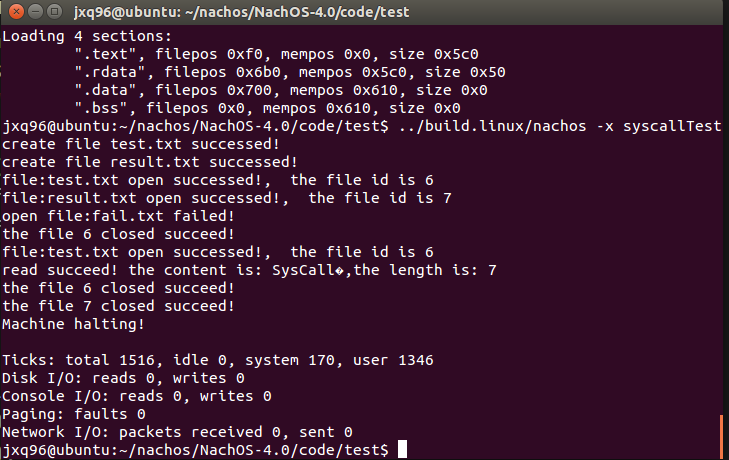
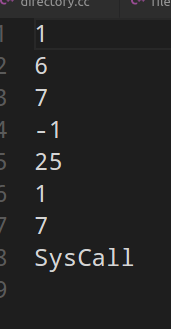

# OS Lab1 Report

## 添加系统调用的步骤解释

  添加系统调用的步骤：
  - 在syscall文件中定义系统调用号以及系统调用接口
  - 在start.S文件中添加进入内核的入口
  - 在ksyscall.h中实现内核函数
  - 在exception.cc文件中实现中断服务例程

  由于nachos项目文件中已经写好了系统调用号、用户系统调用的接口以及进入内核系统调用的接口，实验中只需添加中断服务例程的代码以及内核中系统调用实现的代码即可。

## 核心代码解释

### Create系统调用

#### 内核实现

```c
  int SysCreate(char*name){
      bool flag;
      FileSystem *filesys=new FileSystem();
      flag=filesys->Create(name);
      delete filesys;
      if(!flag){
        return -1;
      }
      else{
        return 1;
      }
}
```

新建FileSystem类并调用其Create（）方法创建名为name的文件，FileSystem类的Create方法返回布尔值表面文件是否成功创建。

#### 中断处理

```c
case SC_Create:
      {
      int baseAddr;
        int temp;
        char*fileNameToCreate = new char[20+1]; //the longest length of file name is 20;
        int count=0; //count for record the length of filename;
        int CreateResult;
        baseAddr=kernel->machine->ReadRegister(4);
      do{
              kernel->machine->ReadMem(baseAddr+count,1,&temp); //read char from memory
          fileNameToCreate[count]=*(char*)&temp;
          count++;

      }while(*(char*)&temp!='\0'&&count<21);//avoid filename too long
      if(count<21){
         CreateResult=SysCreate(fileNameToCreate);
         if(CreateResult<0){
          printf("create file %s failed!\n",fileNameToCreate);
      }
      else{
          printf("create file %s successed!\n",fileNameToCreate);
      }
        kernel->machine->WriteRegister(2,(int)CreateResult);
        delete [] fileNameToCreate;
```

字符数组fileNameToCreate用来存放文件名（不超过20，否则会提示文件名太长），从4号寄存器中读出参数字符串的起始地址再利用循环读出整个字符串（调用ReadMem函数),如果参数字符串符合要求，则调用SysCreate函数，函数返回结果为1则创建成功，为-1则创建失败，最后把结果放入2号寄存器，释放fileNameToCreate空间即完成任务。

### Open系统调用

#### 内核实现

```c
OpenFileId SysOpen(char*name){
  FileSystem *filesys=new FileSystem();
  OpenFile* openfile;
  openfile=filesys->Open(name);
  delete filesys;  //if don't delete it will cause memory leak??
  if(openfile==NULL){
    //printf("open file:%s failed\n",name);
    return -1;
  }
  else{
    return openfile->getOpenFileId();
  }
}
```

新建FileSystem对象调用其Open方法，该方法接受文件名作为参数并返回与文件关联法的OpenFile对象（如果打开失败则返回NULL），系统内核函数的返回值是整型，如果文件打开成功则返回文件Id，否则返回-1.

#### 中断处理

```c
case SC_Open:
      {
	    int baseAddr;
	    int temp;
	    char*fileNameToOpen = new char[20+1]; //the longest length of file name is 20;
	    int count=0; //count for record the length of filename;  
		  OpenFileId OpenResult;
		  baseAddr=kernel->machine->ReadRegister(4);
		  do{
		      kernel->machine->ReadMem(baseAddr+count,1,&temp); //read char from memory
          fileNameToOpen[count]=*(char*)&temp;
          count++;

	  }while(*(char*)&temp!='\0'&&count<21);//avoid filename too long
	  OpenResult=SysOpen(fileNameToOpen);
	  if(OpenResult==-1){
		  printf("open file:%s failed!\n",fileNameToOpen);
	  }
	  else{
		  printf("file:%s open successed!,  the file id is %d\n",fileNameToOpen,OpenResult);
	  }
	  kernel->machine->WriteRegister(2,OpenResult);
    delete [] fileNameToOpen;
```

与创建文件的中断处理类似，从4号寄存器读出来的是参数字符串的首地址，需要循环读出来之后再调用内核函数，最后把结果写入2号寄存器。

#### Write和Read系统调用  

##### 内核实现

```c
 int SysWrite(char*buffer,int size,OpenFileId id){
  OpenFile* openfile=new OpenFile(id);
  int writeResult=openfile->Write(buffer,size);
  //delete openfile;//destructor of Openfile class will call close function to the file
  return writeResult;
}

int SysRead(char*buffer,int size,OpenFileId id){
  OpenFile* openfile=new OpenFile(id);
  int readResult =openfile->Read(buffer,size);
  //delete openfile;//destructor of OpenFile class will call close function to the file
  return readResult;
}
```

SysWrite和SysRead系统函数都接受三个参数，输入输出缓存，输入输出长度以及文件Id。在函数实现中把文件Id传入OpenFile类的构造函数打开已经存中的文件的对象，调用OpenFile类的Write和Read方法实现操作。操作成功返回成功读出或写入字符的长度，否则返回-1.开始写的时候在函数返回之前都会释放掉新的OpenFile对象，但是发现释放之后在运行测试文件时会中途报错，不释放就没有问题，但不释放会造成内存泄漏的问题。我没有找到好的找的好的方法。

```c
 case SC_Write:
	  {
		int bufferStart=kernel->machine->ReadRegister(4); 
		int size=kernel->machine->ReadRegister(5);
		int fileId=kernel->machine->ReadRegister(6);
		char* bufferW=new char[256];
		int count=0;
		int writeResult;
		int temp;
		do{
           kernel->machine->ReadMem(bufferStart+count,1,&temp);
		   bufferW[count]=*(char*)&temp;
		   count++;
		}while(*(char*)&temp!=0&&count<size);
		writeResult=SysWrite(bufferW,size,fileId);
		if(writeResult==size){
			//printf("write succeed! the content is: %s,the length is: %d\n",bufferW,size);
		}
		else{
			printf("write failed!\n");
			writeResult=-1;
		}
		kernel->machine->WriteRegister(2,writeResult);
    delete [] bufferW;

   case SC_Read:
	  {
		int bufferStart=kernel->machine->ReadRegister(4); 
		int size=kernel->machine->ReadRegister(5);
		int fileId=kernel->machine->ReadRegister(6);
		char* bufferR=new char[size];
		int readResult;
		readResult=SysRead(bufferR,size,fileId);
		if(readResult==size){
		for(int i=0;i<size;i++){
			kernel->machine->WriteMem(bufferStart+i,1,(int)bufferR[i]);
		}
		printf("read succeed! the content is: %s,the length is: %d\n",bufferR,size);
		}
		else{
			printf("read failed!\n");
			readResult=-1;
		}
		kernel->machine->WriteRegister(2,readResult); 
    delete [] bufferR;
```
这几个系统调用的中断服务例程的代码都十分类似，从参数传递寄存器中读出参数，然后调用内核函数，最后把结果放入结果寄存器。不再赘述。

#### Close系统调用

##### 内核实现

```c
int SysClose(OpenFileId id){
  int closeResult=Close(id);
   return closeResult;
}
```
直接借用OpenFile类的析构函数中调用的Close函数关闭文件

```c
case SC_Close:
	  {   
		  int fileId=kernel->machine->ReadRegister(4);
		  int closeResult;
		  closeResult=SysClose(fileId);
		  if(closeResult>=0){
		  printf("the file %d closed succeed!\n",fileId);
		       closeResult=1;
		  }
		  else{
			  printf("thr file %d closed failed!\n",fileId);
			  closeResult=-1;
		  }
		  kernel->machine->WriteRegister(2,closeResult
```

代码具体不再赘述，与其他的系统调用相同。

## 实验结果

测试文件运行截图：



生成的文件截图：




创建了test.txt和result.txt,由于创建成功，所以result变量赋值为1，写入result.txt文件。随后调用Open系统调用，由于test.txt和result.txt文件存在，所以可以成功打开并返回文件id，fail.txt不存在，打开失败，返回-1，分别把打开文件得到的三个结果写入result.txt文件，文件id 6和7以及打开失败的返回值-1.将字符串“SysCall Test for Nachos! ”写入test.txt,接着调用Read系统调用读出长度为7的内容“SysCall”，再把Write和Read函数返回值以及读出的字符串写入result.txt中。关闭文件。

## 实验中遇到的问题及实验总结

 整个实验过程中时间主要花在环境以及涉及到的Nachos源码的熟悉，主要阅读了FileSystem类和OpenFile类，熟悉这两个类提供的文件操作的接口。

 实验中也遇到一些问题，比如前面提到的可能导致内存泄漏的问题。其余的实验中的问题主要是书写代码过程中的一些细节错误，最后调试过程中解决的，比如测试文件字符串“SysCall Test for Nachos! ”后面是有一个空格的，我一开始没有注意，导致测试程序运行之后test.txt文件的内容始终在结尾乱码，但test.txt文件内容正常，终端输出的内容也正常，这个小错误花了我两到三个小时调试。